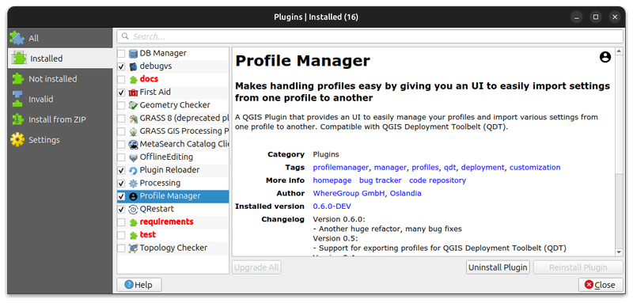

# Development

## Environment setup

> Typically on Ubuntu (but should work on Windows).

### 1. Install virtual environment

Using [qgis-venv-creator](https://github.com/GispoCoding/qgis-venv-creator) (see [this article](https://blog.geotribu.net/2024/11/25/creating-a-python-virtual-environment-for-pyqgis-development-with-vs-code-on-windows/#with-the-qgis-venv-creator-utility)) through [pipx](https://pipx.pypa.io) (`sudo apt install pipx`):

```sh
pipx run qgis-venv-creator
```

Old school way:

```bash
# create virtual environment linking to system packages (for pyqgis)
python3 -m venv .venv --system-site-packages
source .venv/bin/activate
```

### 2. Install development dependencies

```sh
# bump dependencies inside venv
python -m pip install -U pip
python -m pip install -U -r requirements/development.txt

# install git hooks (pre-commit)
pre-commit install
```

### Dedicated QGIS profile

It's recommended to create a dedicated QGIS profile for the development of the plugin to avoid conflicts with other plugins.

1. From the command-line (a terminal with or OSGeo4W Shell):

    ```sh
    # Linux
    qgis --profile plg_profile_manager
    # Windows - OSGeo4W Shell
    qgis-ltr --profile plg_profile_manager
    # Windows - PowerShell opened in the QGIS installation directory
    PS C:\Program Files\QGIS 3.40.4\LTR\bin> .\qgis-ltr-bin.exe --profile plg_profile_manager
    ```

1. Then, set the `QGIS_PLUGINPATH` environment variable to the path of the plugin in profile preferences:

    

1. Finally, enable the plugin in the plugin manager (ignore invalid folders like documentation, tests, etc.):

    
