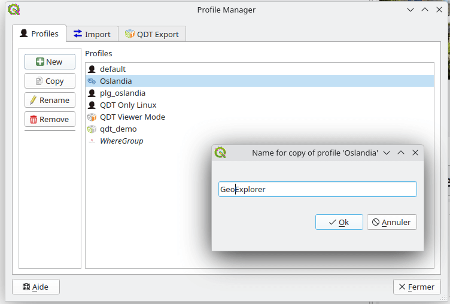
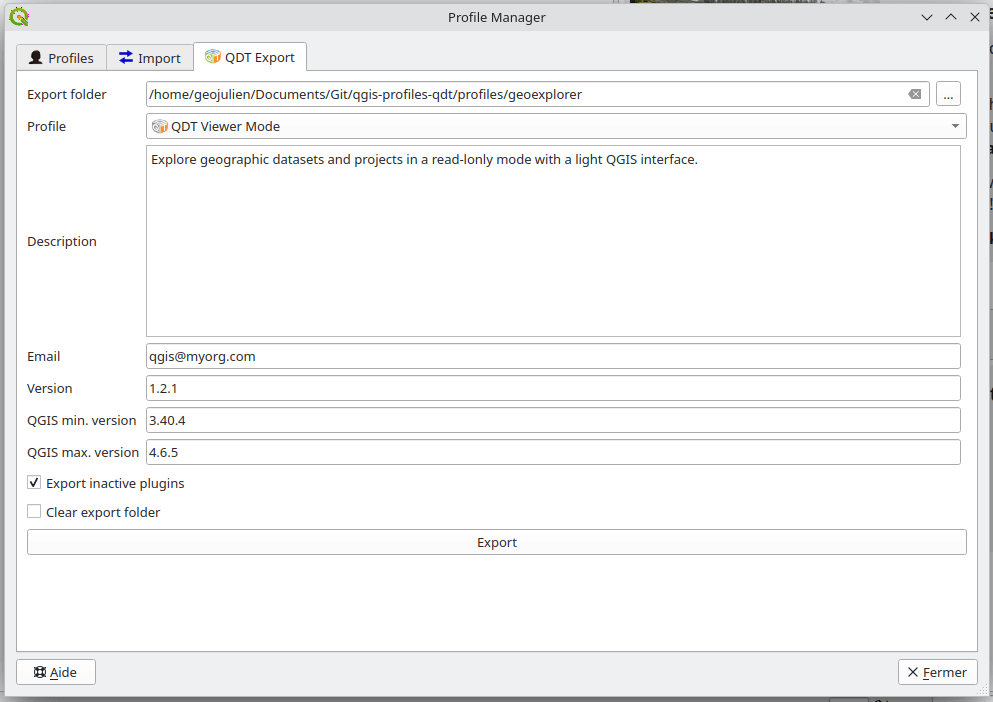

# {{ title }} - Documentation

> **Description:** {{ description }}  
> **Author and contributors:** {{ author }}  
> **Plugin version:** {{ version }}  
> **QGIS minimum version:** {{ qgis_version_min }}  
> **QGIS maximum version:** {{ qgis_version_max }}  
> **Source code:** {{ repo_url }}  
> **Last documentation update:** {{ date_update }}

----

**{{ title }}** is a QGIS plugin designed to simplify the creation, maintenance, and synchronization of QGIS user profiles. It provides a graphical interface to copy, modify and transfer configuration elements between profiles.






This tool is particularly useful in environments where:

* QGIS must be deployed across multiple workstations
* Standardized configurations must be maintained
* Profiles must be prepared before automated deployment (e.g., using [QGIS Deployment Toolbelt aka QDT](https://qgis-deployment.github.io/qgis-deployment-toolbelt-cli/))

## Typical use cases

### Preparing a reference profile

Administrators or power users can create a validated profile containing:

* Approved plugins
* Preconfigured data connections
* Corporate styles and templates
* Standard environment variables

This profile can then be distributed manually or through deployment tools such as QDT.

### Maintaining multiple work contexts

Examples:

* Production vs testing environments
* Each profession has its own QGIS profile
* Different customers or projects
* Training vs operational setups

### Supporting automated deployment

Profile Manager allows users to prepare or adjust profiles before exporting or integrating them into automated deployment pipelines.

----

## Table of contents

```{toctree}
---
caption: Usage
maxdepth: 1
---
usage/installation
usage/manage_profiles
usage/transfer_between_profiles
usage/export_qdt
usage/good_practices
usage/with_qdt
```

```{toctree}
---
caption: Contribution guide
maxdepth: 1
---
development/contribute
development/environment
development/documentation
development/translation
development/packaging
development/history
Code documentation <_apidoc/modules>
```
