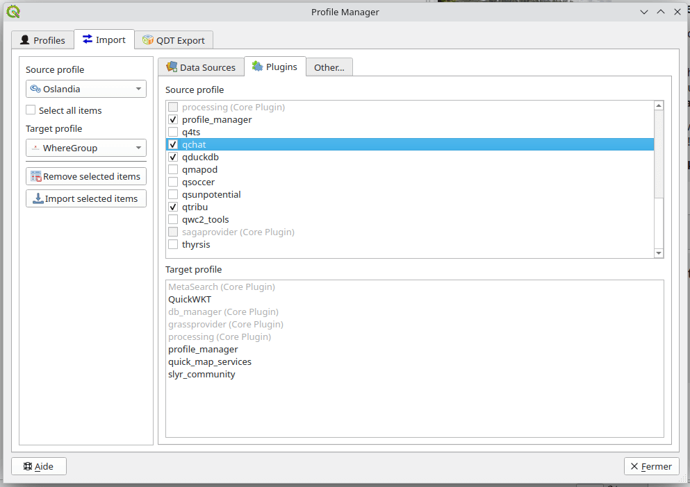
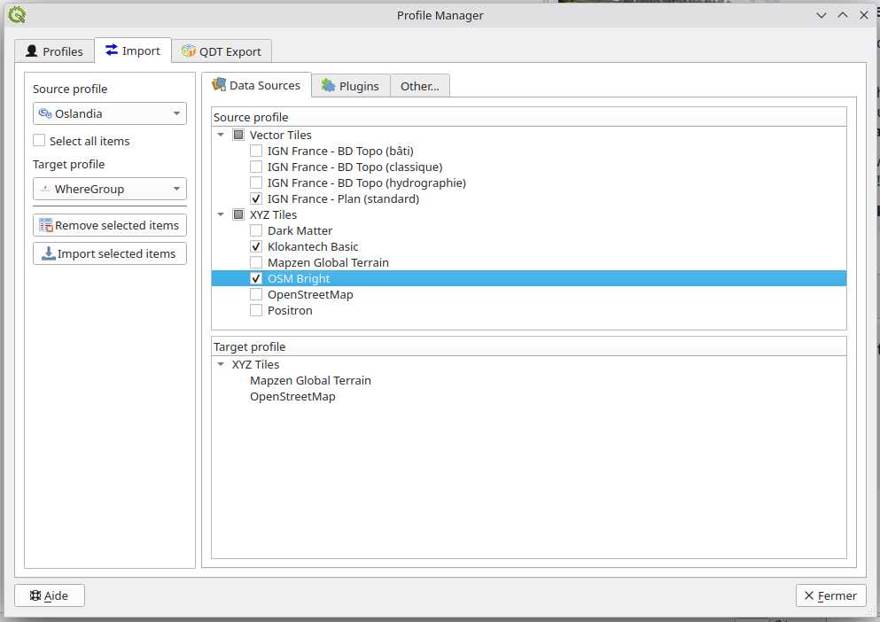
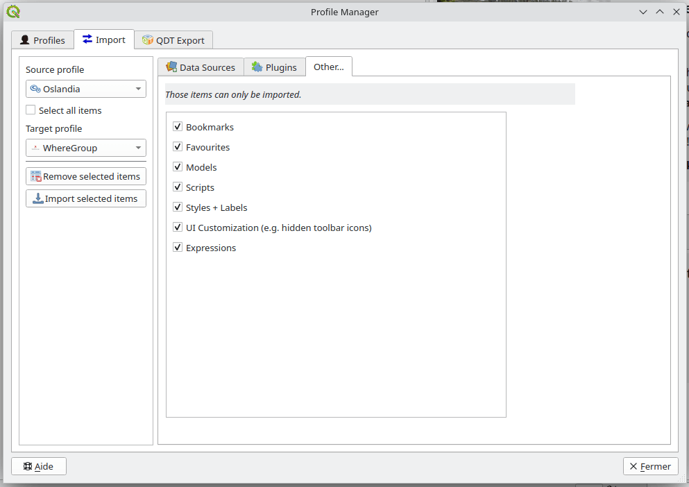

# Transferring Configuration Between Profiles

Profile Manager allows partial configuration transfers without copying an entire profile. This is useful when updating an existing deployed profile with new components.

## Import Workflow

1. Open the **Import** section
2. Select:

   * Source profile
   * Target profile

3. Choose configuration elements to transfer
4. Start the import process

## Transferable items

Depending on the QGIS and plugin versions, you may transfer:

* Database connections
* Web service connections (WMS, WFS, etc.)
* Installed plugins
* Styles and symbols
* Bookmarks
* Processing models and scripts
* User variables
* Custom Python functions
